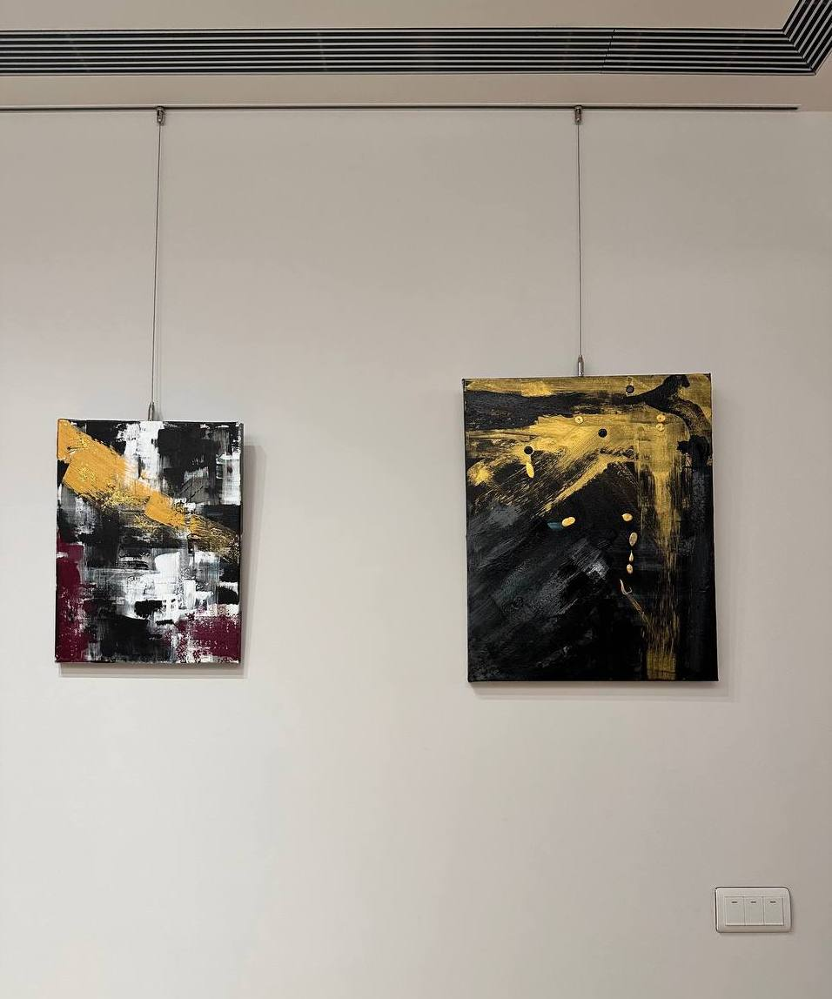
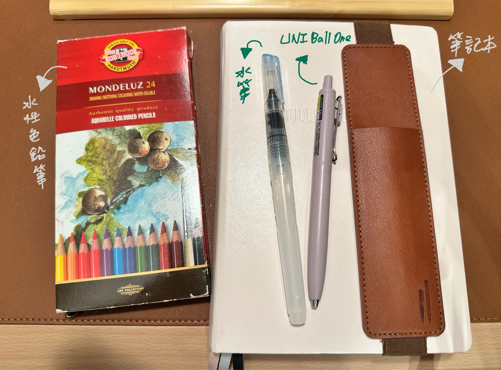
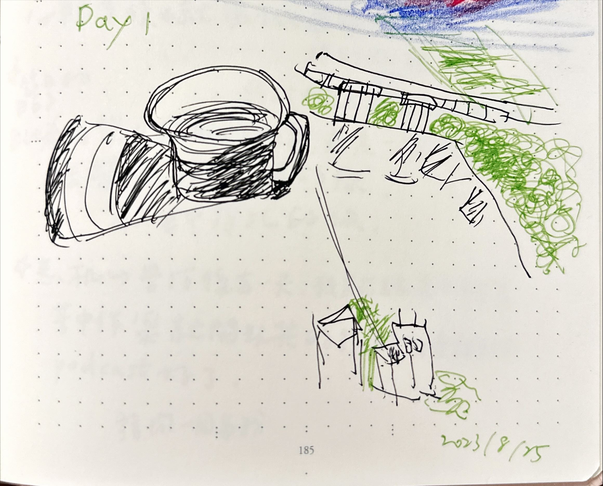

+++
author = "Chialin Shih"
title = '新手畫畫路上的學習資源推薦'
description = "最近將畫畫傳到社群媒體後，陸續得到一些回饋和學習資源，自己也慢慢從網路影片找到對新手來說是個好入門的學習方法，所以也想推薦幾個針對不同層面的相關資訊給有興趣的人。" 
date = 2023-09-19
image = 'sketch-day14.jpg'
tags = ['Learning']
categories = [ "Info" ]
draft = false
+++

## 探索
我曾經探索過兩種迥異的繪畫方式。首先，先嘗試抽象壓克力畫，我非常喜歡這種類似油畫質感以及自由風格的繪畫方式，但因為畫畫的環境設定相較麻煩以及畫作存放體積較大的關係，所以我沒有辦法每天畫。

這目前掛在自己書房中兩幅自己很喜歡的壓克力顏料畫。

其次是上軟體工具 Procreate 的線上課程，是極具便利性的工具，但因軟體工具操作不熟悉與繪畫知識量過大，也無法引起我的興趣，上完一堂課我就放棄了。雖然我在探索的過程中還嘗試了其他繪畫方式和教學，但最終都未能延續繪畫的樂趣。

## 「紙」與「筆」
偶然間，我觀看了一部影片，決定回歸最基本的工具，一隻筆與紙。從此，每日繪畫時間成為我心靈的療癒的時光。

途中我嘗試以現有的色鉛筆營造不同畫風，逐漸組合成自己的繪畫工具組合。其中，我將原本的 UNI Ball One 黑筆換成了防水的代針筆，而代針筆是意外在文具賣場看到買來，目的是避免水性原子筆會遇水而和鉛筆的顏色融在一起導致顏色不對的狀況，目前還在適應中。

由於一開始的想學畫畫的時候其實並沒有找到適合自己的學習方式和資源。最近將畫畫傳到社群媒體後，陸續得到一些回饋和學習資源，自己也慢慢從網路影片找到對新手來說是個好入門的學習方法，所以也想推薦幾個針對不同層面的相關資訊給有興趣的人。

## 新手入門心態篇
- 朋友推薦的愛麗絲網站：[零基礎如何自學畫畫？沒天份怎麼辦？](https://fernweh-art.com/self-study-drawing/)
- Youtube 影片：[Advice for new artists - and anyone who's struggling.](https://youtu.be/tYCJCQ9xhO8?si=zd5z6bdWpAGjIn3S)

## 超新手入門技巧
- Youtube 影片： [Learn How to Draw for Beginners - Episode 1](https://youtu.be/Wz6DrQeQ5rI?si=Ru2DYyyW-gExZ8TV)

## 素材
- 產生 2D 素材網站：[AutoDraw](https://www.autodraw.com/)
- 朋友推薦的愛麗絲 IG：[學習方式與 30 天素材](https://www.instagram.com/p/Ctbkn63vmki/?utm_source=ig_web_copy_link&igshid=MzRlODBiNWFlZA==)

當我回顧「 Day 1」 畫的圖，雖然當初是完全無法精準描繪物體的狀況，但我依舊很開心的每天練習與畫我想畫的主題。這段經歷讓我領悟到原來不見得每一件事情都要做完美或是需要不斷顯示自己的能力，心靈才會滿足。自己的內在價值也不需要完全依靠外界的標準來肯定自己。

