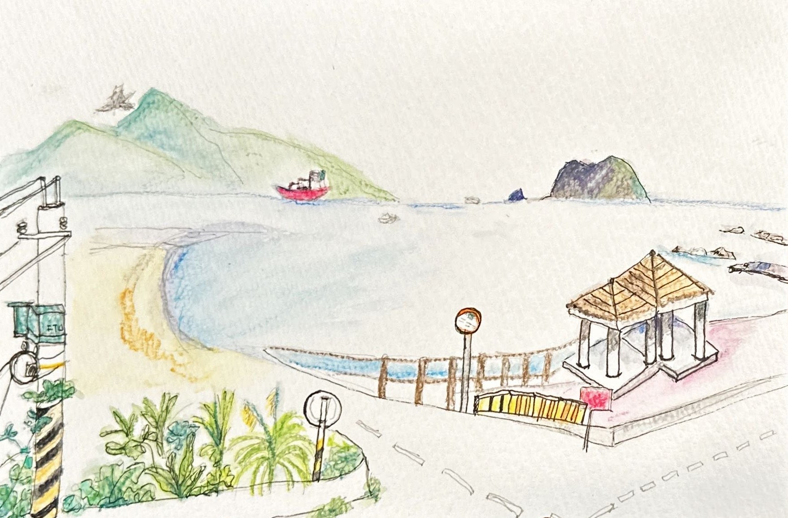

+++
author = "Chialin Shih"
title = '基隆大武崙奧底漁港景色'
description = "最近在觀察周遭景色時，我發現電線杆與電線與周邊景色交織在一起成為獨特的景象。"
date = 2023-10-16
image = 'dawulun-Keelung.jpg'
tags = ['sketch']
categories = [ "色鉛筆" ]
draft = false
+++

螃蟹肥美的季節已到，我早早計畫至萬里吃螃蟹。回程時，找了在基隆大武崙奧底一間靠近海邊的咖啡館，享受寧靜的海景。這次繪畫中面臨的問題是如何在畫中呈現我看到的美麗景色？在景色中有著各種不同元素，包括了自然景觀的山、海、天空與各種人造物，最後選擇著重在電線杆附近的綠景與遠方基隆嶼。

過去，我總覺得電線杆會讓台灣的景觀變得不美觀，幸好因為「電纜地下化」的關係，電線杆與交錯的電線也慢慢變少。

然而，最近在觀察周遭景色時，我卻發現電線杆與電線與周邊景色交織在一起成為獨特的景象。但仔細回憶，電線杆不只是台灣特有的景色，我記得去泰國、越南旅遊時，看到他們路上的電線杆和電線比台灣還錯綜複雜因此有著深刻的印象。

我陷入思考，如果不是獨特性，那我意識中選擇畫出電線杆的想法是什麼？

經過一連串的思考，原來我是想捕捉在非日常事件中還是伴隨著生活感的小細節。

