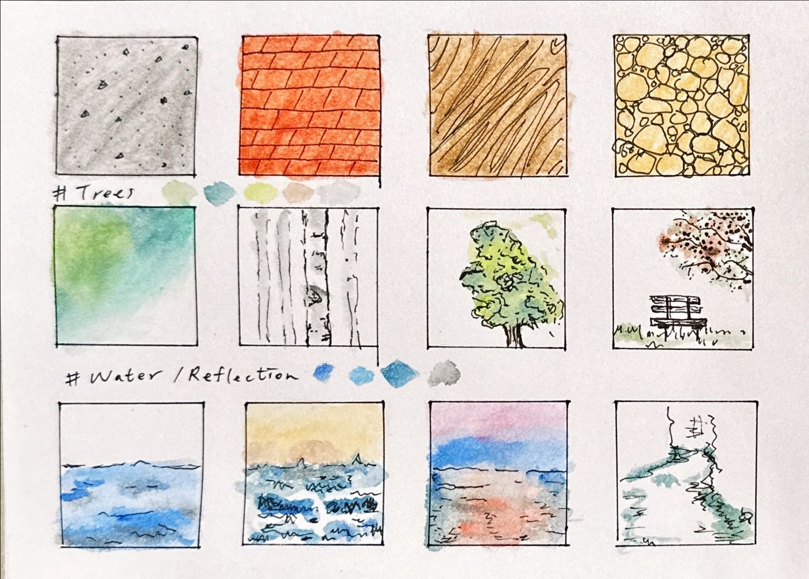

+++
author = "Chialin Shih"
title = "建築與天然質地練習"
description = ""
date = 2023-12-02
image = ""
tags = ["sketch"]
categories = [ "色鉛筆", "速寫練習", "Info" ]
draft = false
+++

# 練習主題-建築與天然質地的繪畫練習

參考網路上面的教學影片和圖片，選擇幾種較常遇到的物體來練習，第一排為自己選擇比較常遇到的建築質地練習；第二排為不同樹木的畫法；第三排為水與其反射景色的畫法。

覺得水平面與水的反射風景是最難控制與描繪。另外，這次遇到的困難是調色問題，因為我是直接沾色鉛筆畫在紙上會造成顏色太重或水分太多，之後應該要像水彩一樣先調好顏色的濃淡度再上色。

# 這次學到什麼技巧？

1. 建築可以利用建築紋理來表現。
2. 樹葉可以用點的方式來簡單的標示，最後再利用顏色的深淺點綴來進行創作。
3. 水平面可以利用線條的起伏來表現浪的大小。
4. 利用深色的顏色來呈現水的深淺陰影 。

# 參考

- [自然質地 Youtube 影片參考](https://youtu.be/Sbr5Riq0K6w?si=q53MuuWsLsWeodZX)
- [建築紋理 IG 圖片參考](https://www.instagram.com/p/CyVymjEt9BJ/?igshid=MzRlODBiNWFlZA==)