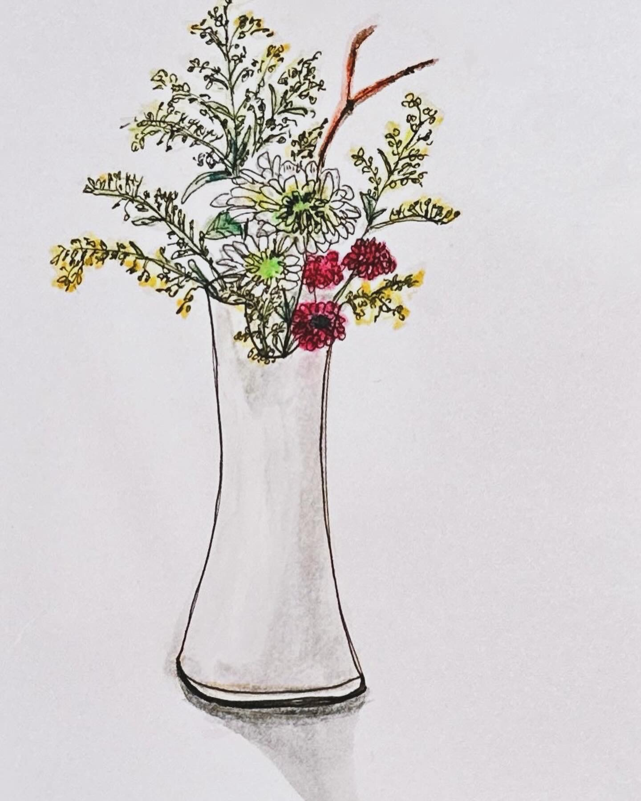

+++
author = "Chialin Shih"
title = "3月花藝作品"
description = "繪畫自己第一個動手做的花藝作品"
date = 2024-03-10
image = ""
tags = ["sketch"]
categories = [ "色鉛筆" ]
draft = false
+++

最近因為某事務煩心，想專注做好這件事情，也相信自己之後還是會想畫，只是時間的問題，因此暫時將每日繪畫練習擱下。
然而最近去參加花藝體驗課後，第一次自己嘗試從買花到做出作品，完成作品後的心情是不可言喻的滿足與喜悅，這卻再勾起了幾個月前繪畫時的感受。
這想法在腦中盤踞幾天後，我情緒上還是想要用繪畫的方式嘗試呈現出來，因此決定利用這週假日的時間畫下這個色鉛筆作品。
繪畫途中，雖遇到了許多問題，但最明顯的是「畫面焦點」迷失的問題。原本預期的焦點應該是在白花上面，最終因為技術問題而無法在白紙上呈現白花的形狀。

檢討後，在網路上找到了幾個畫白色物體的教學影片，剛好就當作是下週的練習主題吧。

# 參考
- [如何用色鉛筆在白紙上畫白花](https://www.youtube.com/watch?v=Hu3lOCMQKLc)
- [白色物体怎么画？色鉛筆教程](https://www.youtube.com/watch?v=QN9WUtVOjUE)