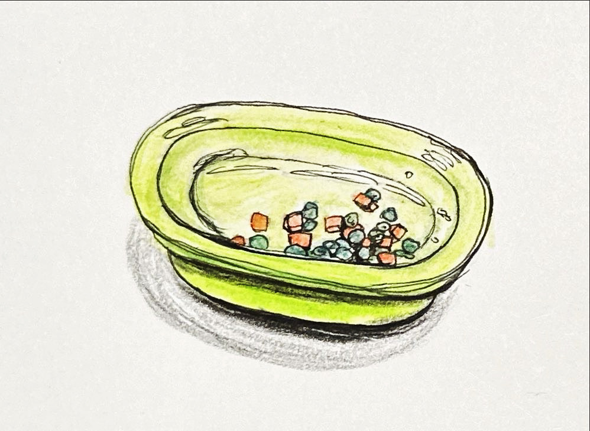

+++
author = "Chialin Shih"
title = "青豆與紅蘿蔔"
description = ""
date = 2023-12-06
image = ""
tags = ["sketch"]
categories = [ "色鉛筆" ]
draft = false
+++

# 主題-食物與器皿

圖示是一個吃完炒飯後憤怒情緒，盤中全是被挑出的青豆與紅蘿蔔。

# 這次學到什麼技巧？

嘗試把反光用一個略為橢圓形狀呈現的方法應用在盤子的盤底與邊緣上。

# 參考
- 《[速寫入門自學聖經](https://www.eslite.com/product/1001113692764459)》中提到的光影表示法