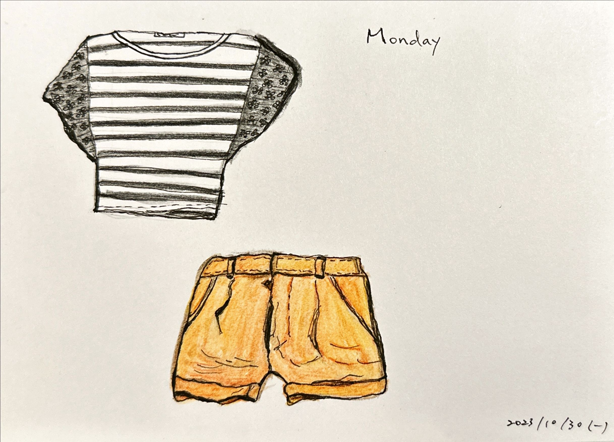

+++
author = "Chialin Shih"
title = '11月的穿搭系列 - 週一穿著'
description = ""
date = 2023-10-30
image = 'outfit-cover.jpg'
tags = ['sketch']
categories = [ "每月穿搭" , "色鉛筆"]
draft = false
+++

為了解決每天站在衣櫃猶豫的穿衣選擇障礙問題，我嘗試《最美的五套》書中提出的穿搭概念進行變化：每月規劃七套，每週重複穿著。

進行規劃的當下突然覺得「一個月穿搭」這是個好主意，在探索不同主題的同時，這個方式也可以幫助自己發現需要呈現不同質感衣著所缺少的技巧。

