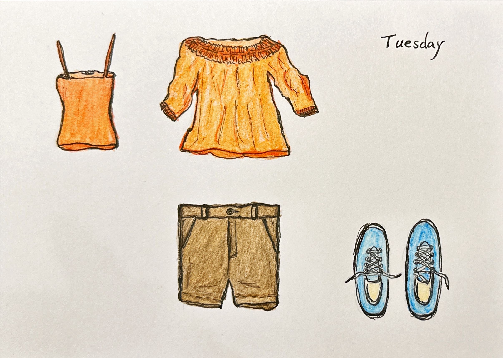

+++
author = "Chialin Shih"
title = '11月的穿搭系列 - 週二穿著'
description = ''
date = 2023-11-03
image = 'outfit-cover.jpg'
tags = ['sketch']
categories = [ "每月穿搭" , "色鉛筆"]
draft = false
+++

週二穿搭的七分袖上衣，材質輕盈加上領口複雜的滾邊裝飾，這些細節設計造就衣服的飄逸風格，但也因為這樣卻讓描繪也變得更為困難。
褲子和鞋子則是利用自己抽象的方式，簡化為更基本的線條，以便於繪畫。

接下來，我需要先觀察別人手繪衣服的畫法來進一步學習與模仿。

