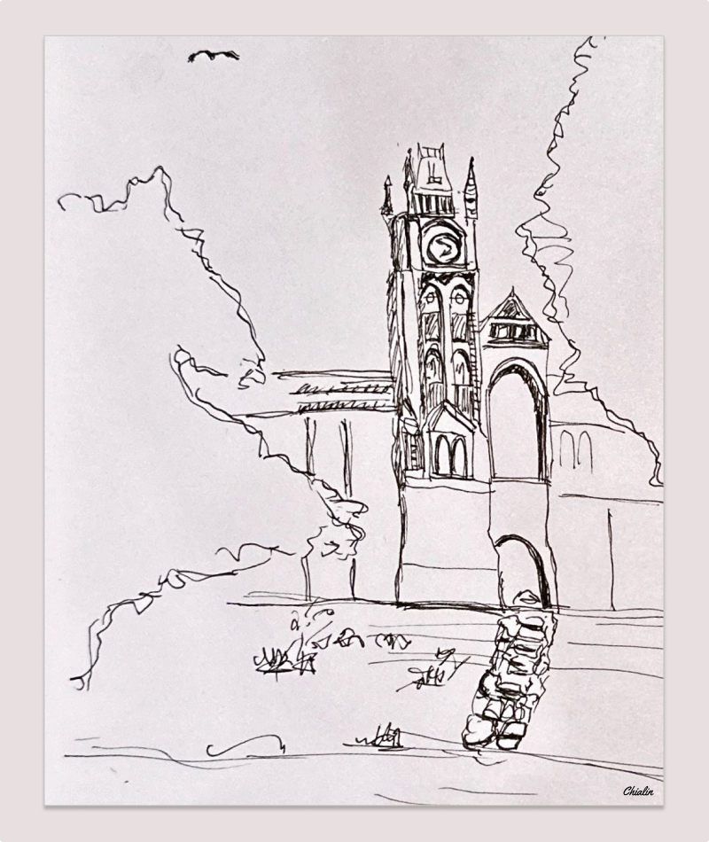

+++
author = "Chialin Shih"
title = "速寫技巧-聚焦法"
description = ""
date = 2023-11-18
image = ""
tags = ["sketch"]
categories = [ "速寫練習" ]
draft = false
+++

速寫一個物件時，如果周遭與物件的環境是非常複雜的構圖，此時可以利用「聚焦法」，就是將描繪的細節放在主要物體，旁邊的物體則描繪大致上的輪廓即可，適時的留白能讓整個畫面更聚焦在主要物體上。

# 練習主題-建築

練習書中的圖像主要是想呈現中間的建築物體，所以其他兩旁的樹木和建築則大略勾勒出輪廓即可。

畫完的效果似乎蠻不錯的，但有一些小缺點需要改進。

### 可以改進的地方
因為自己多加了右下角的石頭路與路面。但石子路似乎有點太筆直，形狀也有點看不太出來，需要進一步觀察如何描繪這種歐洲不規則形狀的石頭路。另外，這樣的作法的缺點就是又將畫面的重點分散到右下方，而不僅僅只是在建築中間的主體上。

# 這次學到什麼技巧？
**使用「聚焦法」的方式呈現主體**。

# 參考
- 《[速寫入門自學聖經](https://www.eslite.com/product/1001113692764459)》的 3.5 章節