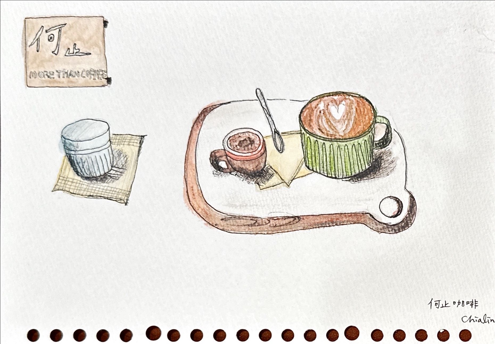

+++
author = "Chialin Shih"
title = '描繪咖啡用具-何止咖啡館'
description = ""
date = 2023-10-10
image = 'coffee-cups-hozhi.jpg'
tags = ['sketch']
categories = []
draft = false
+++
# 內文

這次我參考在《初學素描聖經》內敘述如何利用光影的方式來塑造一個物體的空間感。

因此這在描繪木板的圓形把手端時，我仔細觀察實際光影的走向，一邊嘗試增加陰影來模擬立體感。這個過程讓我理解了光影如何影響我們大腦理解畫面中物體的樣子。

以結果來說，畫面中的立體感確實接近我預期的樣子。然而，還有值得改進的地方：首先，整體上的光影，由明到暗並未明顯區分出來，其次，光源方向的一致性也還尚未考慮進去。
目前正處於探索光影表現的階段，我認為還需要多練習和實驗，才能理解光影的表現方式與其運用的時機。

