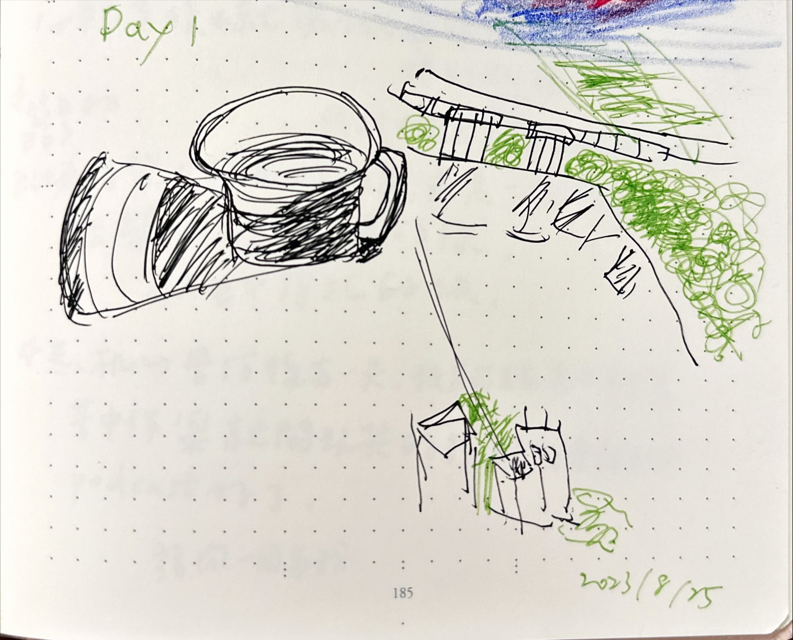

+++
author = "Chialin Shih"
title = '每日繪畫探索的開始'
description = ""
date = 2023-08-25
image = 'start-journey.jpg'
tags = ['sketch']
categories = [ "繪畫入門：30日探索" ]
draft = false
+++

這階段是重新嘗試使用最簡單的方法來學習畫畫，不設限任何形式與成果。

利用每日在陽台曬太陽的空閒時間（約莫 10 分鐘）來探索自己對繪畫的興趣，畫下眼見所及的咖啡杯與景色，工具則是取用身邊現有的資源。

## 工具

- 筆記本
- UNI ball-one 0.38鋼珠筆
-  PILOT Jucie 系列的綠色中性筆

