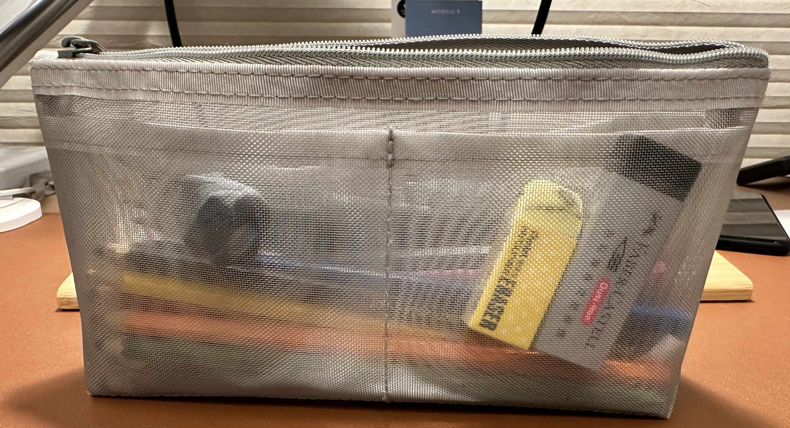
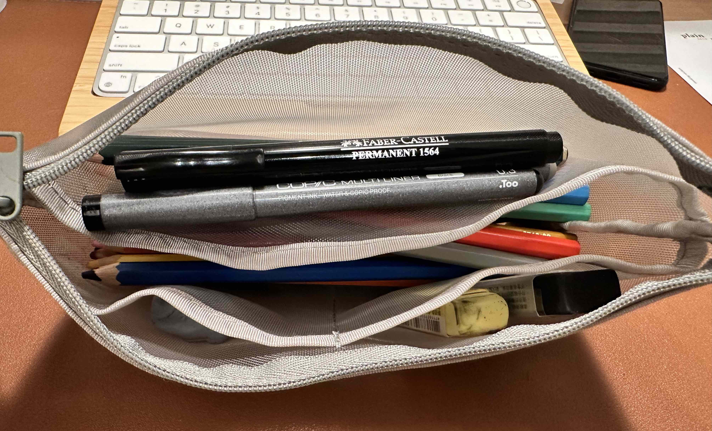
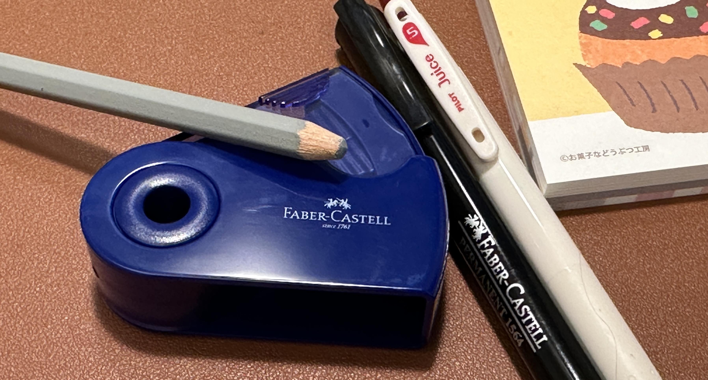

+++
author = "Chialin Shih"
title = '繪畫工具-削筆器與筆袋'
description = ""
date = 2023-10-25
image = 'pencil-sharpener.jpg'
tags = ['sketch']
categories = [ "工具" ]
draft = false
+++

# 筆袋

由於我的色鉛筆原本紙製外盒快壞掉了，因此開始在網路尋找合適的筆袋。網路上有看到卷布形式、塑膠或鐵盒子不同形式的選擇，但這些容器都各有我不喜歡的點。後來，在無印良品店內看到輕巧的網袋形式的筆袋，內側兩旁皆有夾層，一大兩小，覺得蠻適合的就購買了。
這個筆袋主要空間足以容納 24 支色鉛筆，大的夾層則放水筆、鉛筆與代針筆，而小夾層則放橡皮擦。小缺點是上色時，要把筆都拿出來放在桌上，但我還蠻喜歡這樣的方式，所以暫時還不是困擾。
整體上來說，這個筆袋體積小又輕巧且附有夾層可以分類物品，目前我使用起來非常滿意。

# 削筆器

我原本一直在美工刀與削筆器兩種削鉛筆工具間猶豫不決，主要原因是我覺得使用美工刀削鉛筆太麻煩。最後是我在一次線上課程中，聽到老師介紹輝柏（FABER CASTELL）的削筆器後，這個推薦讓我終於決定使用削筆器來削色鉛筆就好了。
